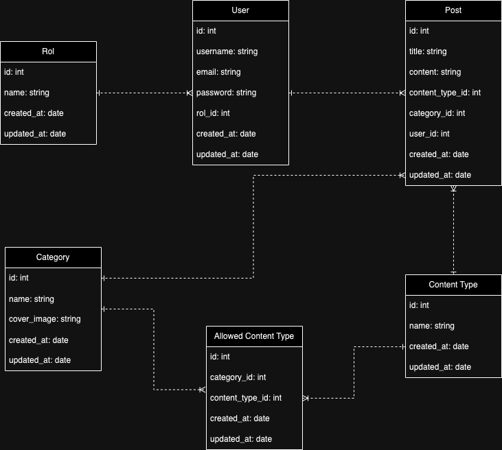
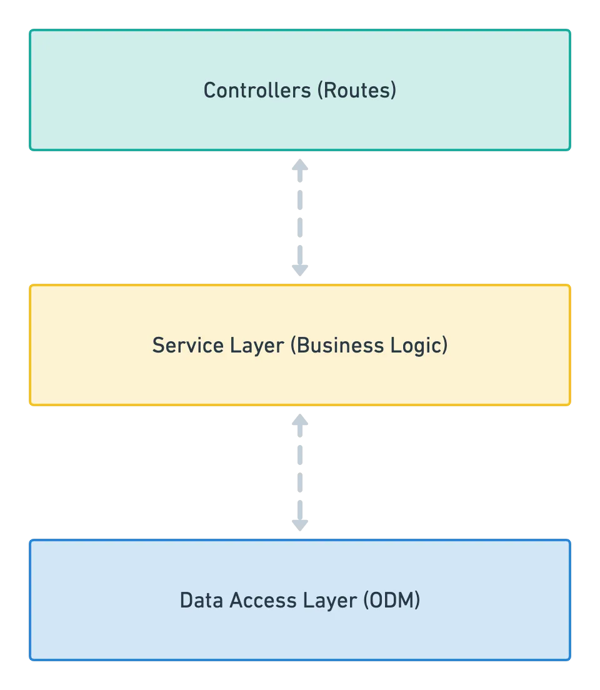

<h1>#DISRUPTIVE MULTIMEDIA SYSTEM</h1>
<h2>Tecnologias usadas</h2>
<ul>
    <li>BACKEND: NODEJS + EXPRESS + NESTJS</li>
    <li>FRONTEND: IONIC + REACTJS</li>
    <li>BD: MONGO NOSQL</li>
    <li>TESTING: CYPRESS</li>
    <li>Otras herramientas: Postman</li>
</ul>

<h2>Instrucciones (para backend y frontend)</h2>

## Installation

```bash
$ npm install
```

## Running the app

```bash
$ npm run start
```
## -- NOTA -- Si restauras la BD del backup, puedes usar las siguientes cuentas:
<ul>
    <li>Para admin. username: test , password: admin</li>
    <li>Para creador. username: carlosplusplus , password: test</li>
</ul>

<br/>

<h2>Documentación</h2>
<h4>Diagrama de clases o Entidad Relación</h4>

<p>Si bien la base de datos sugerida es No Relacional, el diagrama de clases siempre es oportuno para tener un panorama de las entidades que vamos a trabajar y cual es su dependencia entre ellas.</p>
<br/>
<h4>Arquitectura</h4>

<p>Se usó una arquitectura de 3 capas (de controlador, servicios y entidades) que puede ser migrado posteriormente (con más tiempo) a una arquitectura hexagonal de manera orgánica.</p>
<h4>Api Documentation</h4>
La documentación total del proyecto se hizo a traves de la plataforma de Postman, la colección está ubicada en la carpeta <b>documentation</b>, pero hay una versión en línea donde se podra visualizar con mucha más claridad. 
API DOC: puede ser visitado a través de la siguiente URL: [Api Docs](https://documenter.getpostman.com/view/30110498/2sA3dyiqv7)
<h4>Video Demo</h4>
[Video demostrando todo el flujo del aplicativo](https://drive.google.com/file/d/14nRCPgglDrXwZ9zauWmDv9QSoErjxXcZ/view?usp=sharing)


<h2>Cosas que mejorar</h2>
<ul>
    <li>En backend, para que tenga una escalabilidad muy grande, se podria migrar a una arquitectura hexagonal limpia</li>
    <li>En backend, se podria agregar repositorios.</li>
    <li>En backend, se podria mejorar aun mas el formato de respuesta.</li>
    <li>En frontend, se podria agregar tambien una arquitectura hexagonal</li>
    <li>En frontend, se podria agregar aprovechar mejor el uso de custom hooks para encapsular logica</li>
    <li>Con mucho más tiempo el proyecto se podria orientar a ser más TDD, lo que lograria aumentar la cantidad de coverage y tests</li>
</ul>